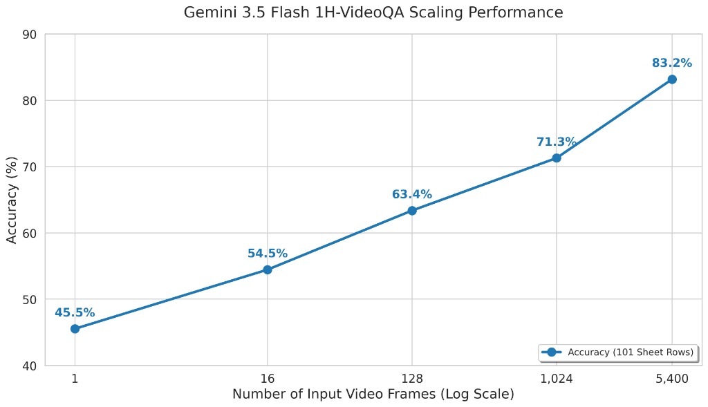

<!--
Copyright 2025 Google LLC

Licensed under the Apache License, Version 2.0 (the "License");
you may not use this file except in compliance with the License.
You may obtain a copy of the License at

    http://www.apache.org/licenses/LICENSE-2.0

Unless required by applicable law or agreed to in writing, software
distributed under the License is distributed on an "AS IS" BASIS,
WITHOUT WARRANTIES OR CONDITIONS OF ANY KIND, either express or implied.
See the License for the specific language governing permissions and
limitations under the License.
-->

# 1H-VideoQA

Google DeepMind is open-sourcing its 1H-VideoQA dataset.
Please cite https://arxiv.org/abs/2403.05530 if you use this evaluation.

1H-VideoQA is our own internally "hand-made" dataset of hour long Youtube videos with questions and answers.
It was built to probe long-context abilities of frontier models.
1H-VideoQA contains 101 5-choice questions collected in-house about 21 YouTube videos, with each video spanning from 40 to 90 minutes long.
1H-VideoQA has proved to be a quick and nice capability check of long-context multimodal models: performance on this dataset scales gracefully with increased context length, and trivial baselines such as blind or single frame do poorly on it.

## INSTRUCTIONS

See kaggle link https://www.kaggle.com/benchmarks/deepmind/video-qa.
